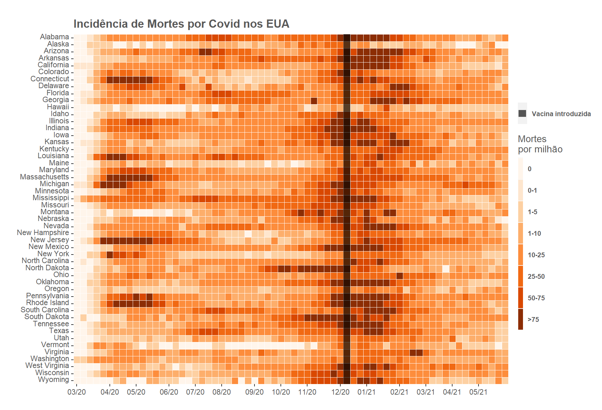

# Covid USA - Incidência de Mortes por Estado

A ideia desse trabalho foi utilizar o [ggplot2](https://ggplot2.tidyverse.org/) para reproduzir o gráfico do blog [RoyFrancis](https://www.royfrancis.com/a-guide-to-elegant-tiled-heatmaps-in-r-2019/), um heatmap de evolução de sarampo ao longo dos anos. Utilizamos dados de Covid-19 e dividimos os dados por semana.

- [Pré-processamento - jupyter notebook](https://github.com/reneroliveira/Covid__USA/blob/main/notebooks/cleaning.ipynb)
- [Trabalho Final - Rmarkdown](https://github.com/reneroliveira/Covid__USA/blob/main/notebooks/Covid_US.Rmd)

Segue a visualização final:

